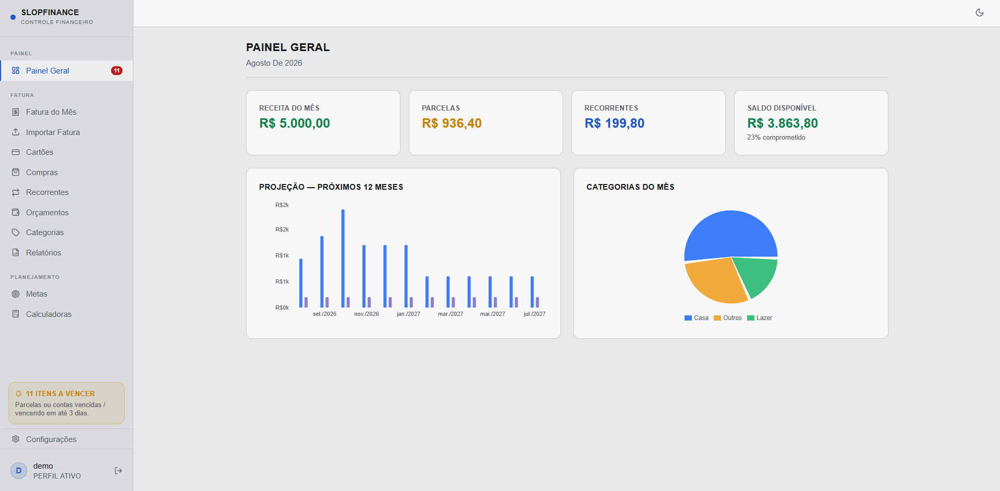

# slopFinance

> Controle financeiro pessoal de uso individual — cartões, faturas, compras parceladas, pagamentos recorrentes, orçamento e relatórios. Substitui a planilha de gastos com foco em entrada de dados sem digitação: importa a fatura do cartão e categoriza sozinho a partir do seu histórico.


---

## O que é

Uma aplicação web local para uma pessoa controlar as próprias finanças sem depender de planilha. Roda na sua máquina, os dados ficam no seu banco Postgres.

O motivo de existir é bem específico: a tentativa anterior desse projeto foi abandonada porque digitar cada gasto manualmente cansa. O diferencial aqui é importar a fatura do cartão (CSV ou PDF, dependendo do banco) e deixar o sistema categorizar sozinho, aprendendo do que você já categorizou antes.

**Funcionalidades principais:**

- **Import de fatura** — Nubank (CSV ou PDF) e Itaú (PDF); categorização aprendida automaticamente do histórico de compras do perfil
- **Cartões de crédito** — cálculo automático de vencimento de parcela conforme dia de fechamento
- **Compras parceladas** — acompanhamento de parcelas pagas/pendentes, edição recalcula o parcelamento
- **Pagamentos recorrentes** — contas fixas mensais com checklist de pagamento
- **Orçamento por categoria** — limites mensais com alerta visual ao aproximar/estourar
- **Metas de economia** — aportes e previsão de conclusão
- **Relatórios em CSV** — compras por ano, gastos por mês
- **Calculadoras financeiras** — juros compostos, preço médio, projeção de objetivo
- **Dashboard** — receita x despesas, projeção dos próximos 12 meses, gastos por categoria
- **Export/import de perfil e backup diário** — tudo em JSON, sem lock-in
- **Web Push** — notificação de parcelas e contas vencendo, mesmo com o app fechado (PWA)
- Autenticação por usuário + senha (sem e-mail), multi-perfil mantido como infraestrutura (uso real é solo)

---

## Stack

| Camada | Tecnologias |
|--------|-------------|
| Backend | Spring Boot 4.0.5, Java 21 (Zulu JDK), Spring Data JPA, Flyway, PDFBox 3, commons-csv |
| Frontend | React 18, Vite, Tailwind CSS, TanStack Query, Recharts, Lucide |
| Banco | PostgreSQL 16 via Docker Compose |
| Testes | JUnit 5, Mockito, RestTemplate — Postgres real via Docker (Testcontainers foi removido) |

Design system documentado em [DESIGN.md](DESIGN.md).

---

## Começando

### Pré-requisitos

| Ferramenta | Versão |
|------------|--------|
| [Zulu JDK 21](https://www.azul.com/downloads/) | 21 (LTS) |
| [Maven](https://maven.apache.org/) | 3.9+ |
| [Docker](https://www.docker.com/) | Qualquer recente |
| [Node.js](https://nodejs.org/) | 20+ |

### Passo a passo

**1. Banco de dados**

```bash
docker compose up postgres -d
```

PostgreSQL sobe na porta **5435** (evita conflito com uma instância local na 5432). O Flyway cria o schema automaticamente no primeiro boot do backend.

**2. Backend**

```bash
cd backend
mvn spring-boot:run
```

Backend em **http://localhost:8085**. Variáveis de ambiente são opcionais para rodar local — veja a seção abaixo.

**3. Frontend**

```bash
cd frontend
npm install
npm run dev
```

Frontend em **http://localhost:5173** (expõe na rede local, `host: true` no Vite).

**4. Primeiro acesso**

1. Acesse **http://localhost:5173**
2. Crie uma conta em **Criar conta** (usuário + senha, sem e-mail)
3. Cadastre um cartão em **Cartões**, depois importe uma fatura em **Importar Fatura** — ou registre compras manualmente em **Compras**

Pra popular um perfil de demonstração com dados fictícios (cartões, compras, orçamento, recorrente, meta) sem depender de arquivo real de fatura:

```bash
backend/scripts/seed-demo.sh
```

---

## Rodar via Docker

Alternativa ao passo a passo manual acima — sobe banco, backend e frontend, cada um no seu container:

```bash
docker compose up -d --build
```

| Serviço | URL |
|---------|-----|
| Frontend | http://localhost:3000 |
| Backend | http://localhost:8085 |
| PostgreSQL | localhost:5435 |

O frontend é servido por Nginx (build estático do Vite) e o Nginx faz proxy de `/api/` pro container do backend. Pra derrubar tudo: `docker compose down` (ou `docker compose down -v` pra apagar também o volume do Postgres).

---

## Estrutura do projeto

```
matheusFinance/
├── backend/
│   └── src/main/java/com/matheusfinance/
│       ├── core/               # Segurança (JWT), exceções HTTP globais
│       ├── infra/               # Config (Security, CORS), backup diário
│       └── features/            # package-by-feature
│           ├── auth/            # Usuário + senha, JWT, troca de perfil
│           ├── perfil/          # Perfis, export/import, limpar dados
│           ├── cartao/
│           ├── compra/          # Compras parceladas + import de fatura (Nubank/Itaú)
│           ├── recorrente/      # Pagamentos fixos + checklist mensal
│           ├── categoria/
│           ├── orcamento/
│           ├── receita/
│           ├── alerta/          # Vencimentos de parcelas e recorrentes
│           ├── meta/            # Metas de economia
│           ├── dashboard/       # Agregações
│           ├── relatorio/       # Export CSV
│           └── push/            # Web Push (VAPID)
│
├── frontend/
│   └── src/
│       ├── core/                # api/axios, types, hooks
│       ├── shared/               # context (Auth, Profile, Theme), componentes ui/layout
│       ├── domains/              # API por domínio
│       └── pages/                # dashboard, cartões, compras, recorrentes, orçamentos,
│                                  # categorias, relatórios, fatura, metas, calculadoras,
│                                  # configurações, auth
│
└── docker-compose.yml
```

---

## Import de fatura

`POST /api/fatura/importar?cartaoId=X&ano=Y&mes=Z&banco=nubank|itau` (multipart, campo `arquivo`). `banco` é obrigatório e decide o parser — a extensão do arquivo sozinha não basta, já que o Nubank tem fatura em CSV *e* em PDF.

| Banco | Formatos aceitos |
|-------|-------------------|
| Nubank | `.csv` ou `.pdf` (fatura fechada) |
| Itaú | `.pdf` (único formato existente) |

A idempotência é por `(cartão, mês)`, não por transação: reimportar substitui o conteúdo daquele mês inteiro, o que evita dedup frágil por hash de linha e permite corrigir uma fatura reimportando. Categorização é aprendida do histórico de compras já categorizadas do perfil — a mesma descrição de estabelecimento puxa a última categoria usada.

---

## Testes

```bash
docker compose up postgres -d
docker exec matheusfinance-db createdb -U finance_user matheusfinance_test   # uma vez só
cd backend
mvn test
```

Os testes de integração usam **PostgreSQL real** em `localhost:5435`, banco `matheusfinance_test`. Não usa Testcontainers (o `docker-java` embutido negocia uma API antiga que o Docker recente recusa).

---

## Variáveis de ambiente

Nenhuma é obrigatória para rodar local — o backend sobe com valores padrão de desenvolvimento. Para customizar, exporte antes de `mvn spring-boot:run` ou copie `backend/.env.example` para `backend/.env`:

| Variável | Descrição | Obrigatória? |
|----------|-----------|---------------|
| `JWT_SECRET` | Segredo JWT (mínimo 32 caracteres) | Não — tem valor padrão de dev |
| `VAPID_PUBLIC_KEY` / `VAPID_SUBJECT` | Chaves do Web Push (gere em [vapidkeys.com](https://vapidkeys.com/)) | Não — sem elas, notificações push ficam desativadas |
| `SPRING_DATASOURCE_URL` / `_USERNAME` / `_PASSWORD` | Override da conexão com o banco | Não — padrão aponta pro Postgres da porta 5435 |

---

## Licença

Uso pessoal. Sem licença de distribuição.
