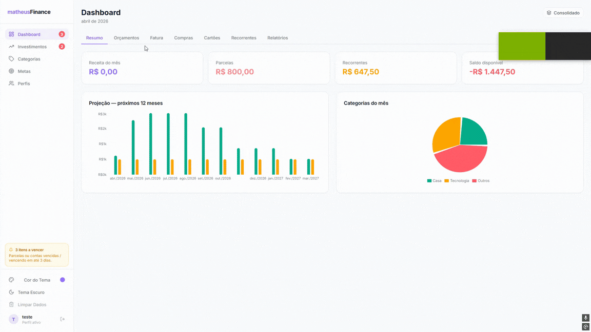

# matheusFinance



> Controle financeiro pessoal com foco em parcelamentos, contas fixas e carteira de investimentos B3.


---

## O que é

Uma aplicação web local para quem quer controlar as próprias finanças sem depender de bancos ou serviços pagos. Tudo roda na sua máquina — os dados ficam no seu banco.

**Principais funcionalidades:**

- **Cartões de crédito** — cadastre seus cartões com dia de fechamento e vencimento
- **Compras parceladas** — registre e acompanhe cada parcela com cálculo automático de vencimento por ciclo de fechamento
- **Pagamentos recorrentes** — contas fixas mensais com checklist de pagamento por mês
- **Carteira B3** — importe posições em CSV ou XLSX (relatório da B3), com cotação em tempo real via Brapi e cálculo de P&L por ativo
- **Dashboard** — resumo do mês, projeção de 12 meses, gráficos de evolução
- **Multi-perfil** — perfis independentes com exportação e importação completa de backup

---

## Stack

| Camada | Tecnologias |
|---|---|
| Backend | Spring Boot 4, Java 25 (Zulu JDK), Spring Data JPA, Flyway, Apache POI |
| Frontend | React 18, Vite, Tailwind CSS, TanStack Query, Recharts, Lucide |
| Banco | PostgreSQL 16 via Docker Compose |
| Testes | JUnit 5, Mockito, Testcontainers, RestAssured |

---

## Começando

### Pré-requisitos

| Ferramenta | Versão mínima |
|---|---|
| [Zulu JDK 25](https://www.azul.com/downloads/) | 25 LTS |
| [Maven](https://maven.apache.org/) | 3.9+ |
| [Docker Desktop](https://www.docker.com/products/docker-desktop/) | Qualquer recente |
| [Node.js](https://nodejs.org/) | 20+ |

### Início rápido (Windows)

```bash
# 1. Clone o repositório
git clone <url-do-repositorio>
cd matheusFinance

# 2. Suba tudo com um comando
start.bat
```

O script `start.bat` inicia o PostgreSQL, compila e sobe o backend e o frontend automaticamente.

Acesse em: **http://localhost:5173**

### Início rápido (Linux / Mac)

```bash
chmod +x start.sh
./start.sh
```

---

## Configuração manual passo a passo

### 1. Banco de dados

```bash
docker compose up postgres -d
```

O PostgreSQL sobe na porta **5435** (evita conflito com instâncias locais na 5432). O Flyway cria todas as tabelas automaticamente na primeira inicialização.

### 2. Backend

```bash
cd backend

# Configure o token da Brapi (opcional — necessário para cotações em tempo real)
cp .env.example .env
# Edite .env e preencha BRAPI_TOKEN com seu token em https://brapi.dev

# Inicie o servidor
JAVA_HOME="C:/Program Files/Java/zulu-jdk-25" mvn spring-boot:run
```

O backend sobe em **http://localhost:8085**.

### 3. Frontend

```bash
cd frontend
npm install
npm run dev
```

O frontend sobe em **http://localhost:5173**.

### 4. Primeiro acesso

1. Acesse **http://localhost:5173**
2. Vá em **Perfis** no menu lateral
3. Crie um perfil e clique em **Selecionar**
4. Pronto — comece a usar

---

## Estrutura do projeto

```
matheusFinance/
├── backend/                        # Spring Boot API
│   ├── src/main/java/com/matheusfinance/
│   │   ├── perfil/                 # Perfis e backup (export/import)
│   │   ├── cartao/                 # Cartões de crédito
│   │   ├── compra/                 # Compras parceladas + cálculo de vencimento
│   │   ├── recorrente/             # Pagamentos fixos + checklist mensal
│   │   ├── investimento/           # Posições B3, cotações Brapi, P&L
│   │   ├── dashboard/              # Agregações para gráficos
│   │   └── shared/                 # Config, segurança, exceções globais
│   └── src/main/resources/
│       └── db/migration/           # Migrations Flyway (V1 → V7)
│
├── frontend/                       # React + Vite
│   └── src/
│       ├── api/                    # Camada de chamadas HTTP por domínio
│       ├── components/ui/          # Design system (Card, Button, Input, Badge…)
│       ├── context/                # ProfileContext, ThemeProvider
│       └── pages/                  # Dashboard, Perfis, Investimentos
│
├── docker-compose.yml
├── start.bat / start.sh            # Scripts de startup
└── stop.bat / stop.sh
```

---

## Importação de posições B3

1. Acesse o portal **CEI** ou **B3** e exporte seu extrato de posições
2. Na tela **Investimentos**, clique em **Importar posições**
3. Selecione o arquivo `.csv` ou `.xlsx` exportado pela B3

O sistema detecta automaticamente o formato. Após a importação, clique em **Atualizar Preços** para buscar as cotações atuais e calcular o P&L de cada ativo.

---

## Backup e restauração de perfil

Cada perfil pode ser exportado como um único arquivo `.json` contendo todo o histórico: cartões, compras, parcelas, recorrentes e investimentos.

```
Perfis → ícone de download no perfil → salva perfil-nome-2025-04-23.json
Perfis → Importar Perfil → seleciona o .json → perfil restaurado
```

Útil para migrar de máquina, manter backups manuais ou compartilhar dados entre ambientes.

---

## Testes

```bash
cd backend

# Todos os testes (unit + integração)
mvn test

# Teste específico
mvn test -Dtest=ParcelamentoCalculatorTest
mvn test -Dtest=PerfilServiceTest
```

Os testes de integração usam **Testcontainers** — um PostgreSQL temporário é criado e destruído automaticamente. Não é necessário ter o Docker Compose rodando.

---

## Variáveis de ambiente

| Variável | Padrão | Descrição |
|---|---|---|
| `BRAPI_TOKEN` | *(vazio)* | Token da API Brapi para cotações em tempo real |
| `SPRING_DATASOURCE_URL` | `jdbc:postgresql://localhost:5435/matheusfinance` | URL do banco |
| `SPRING_DATASOURCE_USERNAME` | `finance_user` | Usuário do banco |
| `SPRING_DATASOURCE_PASSWORD` | `finance_pass` | Senha do banco |

Crie `backend/.env` a partir de `backend/.env.example` para configurar localmente sem alterar o `application.yml`.

---

## Solução de problemas

| Sintoma | Causa provável | Solução |
|---|---|---|
| Frontend não carrega dados | Backend fora do ar | Verifique se o Spring Boot subiu em `localhost:8085` |
| `senha falhou para finance_user` | PostgreSQL não está rodando | `docker compose up postgres -d` |
| `Port 8085 already in use` | Outra instância do backend rodando | Encerre o processo anterior |
| Cotações não atualizam | `BRAPI_TOKEN` não configurado | Preencha `BRAPI_TOKEN` no `backend/.env` |
| Parcelas com datas erradas | `diaFechamento` incorreto no cartão | Revise o cadastro do cartão |

---

## Licença

Uso pessoal. Sem licença de distribuição.
